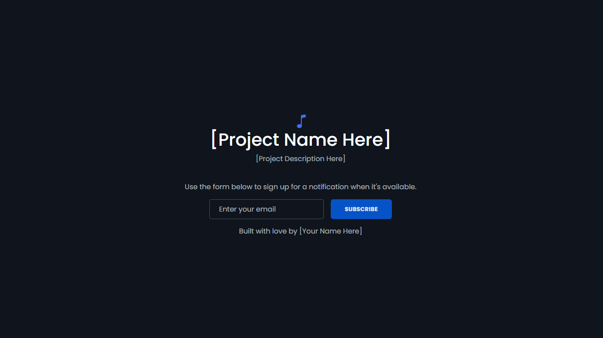

# noti

> This notification web app is actively under development and currently lacks notification-like functionality. I appreciate your patience as I  work on implementing continuous features and improvements.

## 🚀 Overview
noti is a simple notification web app created using Bootstrap and Vite. It is designed for projects that are still under development or haven't been released yet.

## 📦 Installation

To get started, follow these instructions:

```bash
# Clone or fork the repository
+ git clone https://github.com/your-username/noti.git

# Navigate to the project directory
+ cd noti

# Install the required packages
+ npm install
```

## 🌟 Showcase
Current preview of the webapp:


## ✍️ Contributing
If you notice an error in the code or have suggestions for improvement, feel free to create a pull request! Your contributions are welcome.